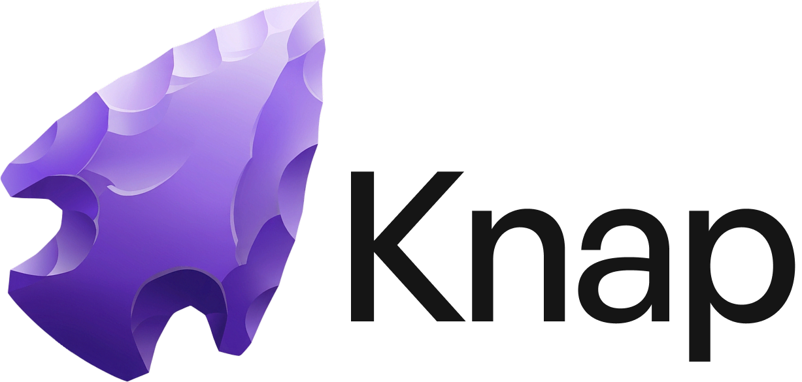

<p align="center">
  <picture>
    <source media="(prefers-color-scheme: dark)" srcset="assets/knap.png">
    <source media="(prefers-color-scheme: light)" srcset="assets/knap-black.png">
    
  </picture>
</p>

<p align="center">
  Persistent knowledge layer for AI-assisted development.<br>
  Session handoff, team conventions, and project context for <a href="https://docs.anthropic.com/en/docs/claude-code">Claude Code</a> — powered by <a href="https://obsidian.md/">Obsidian</a>.
</p>

Named after [knapping](https://en.wikipedia.org/wiki/Knapping) — the ancient process of shaping obsidian into tools.

## What it does

Knap gives your AI coding sessions persistent memory. Instead of starting cold every time, Claude reads your project context, picks up where the last session left off, and knows your team's conventions.

- **HEART.md** — Team DNA. How you build, what you prefer, lessons learned. Evolves over time.
- **PULSE.md** — Raw learnings captured from sessions. Review and promote to HEART.
- **Session handoff** — Claude writes a summary at session end, reads it at session start. No more re-explaining.
- **Context priming** — Map file paths to docs. Touch a Stripe integration file? Claude auto-reads your Stripe docs first.
- **Task tracking** — Claude adds tasks to todos before starting, checks them off when done.
- **Auto-changelog** — Git commits automatically log to the project changelog via hooks.
- **Shared skills** — Claude Code skills stored in the vault, symlinked to `~/.claude/skills/`, synced via git.

## Install

```bash
bash <(curl -fsSL https://raw.githubusercontent.com/n-va/knap/main/install.sh)
```

The installer gives you two options:

1. **Join a team** — paste your team's Knap repo URL, it clones and runs setup
2. **Start fresh** — scaffolds a complete vault with skills, hooks, and conventions

### Requirements

- **macOS** with [Homebrew](https://brew.sh/)
- [Obsidian](https://obsidian.md/) 1.12+ with CLI enabled (Settings > General > Command line interface)
- [Claude Code](https://docs.anthropic.com/en/docs/claude-code)
- git
- [gum](https://github.com/charmbracelet/gum) + [jq](https://jqlang.github.io/jq/) (auto-installed via Homebrew if missing)

## How it works

```
~/Knap/                          ← Your vault (git-synced, browsable in Obsidian)
├── HEART.md                     ← Team conventions and knowledge
├── PULSE.md                     ← Session learnings inbox
├── Projects/
│   └── <ProjectName>/
│       ├── Notes.md             ← Project overview, tech stack
│       ├── Changelog.md         ← Auto-populated from git commits
│       ├── Todos.md             ← Task list (Claude manages this)
│       ├── Last Session.md      ← Session handoff summary
│       └── Context Map.md       ← File path → doc mapping
└── skills/
    └── obsidian-cli/            ← Symlinked to ~/.claude/skills/
```

### Session lifecycle

```
Session Start                     Session End
    │                                 │
    ├─ Read HEART.md                  ├─ Mark todos as done
    ├─ Read Todos.md                  ├─ Write Last Session.md
    ├─ Read Last Session.md           ├─ Append learnings to PULSE.md
    ├─ Read Context Map.md            └─ (hooks auto-commit & push vault)
    └─ Start working
         │
         ├─ Add tasks to Todos.md
         ├─ Context-prime from docs
         ├─ Do the work
         └─ Commit → auto-logs to Changelog.md
```

### Automation hooks

| Hook | Trigger | What it does |
|------|---------|-------------|
| **Post-commit** | After `git commit` in Claude Code | Logs commit message to project's Changelog.md |
| **Session sync** | When Claude finishes responding | Auto-commits and pushes vault changes |
| **Cron sync** | Every 15 minutes | Safety net if hooks didn't fire |

## Why not OpenClaw / other tools?

- **No SaaS.** Your data stays on your machine and in your git repo.
- **No API keys leaking.** Nothing goes to a third-party service.
- **Human-readable.** It's just markdown. Browse it in Obsidian, VS Code, or `cat`.
- **Human-curated.** AI captures learnings (PULSE), humans decide what sticks (HEART).
- **Git-synced.** Works across devices and teams. Standard git workflow.
- **Obsidian-powered.** Full-text search, graph view, backlinks, tags — for free.

## Adding skills

Drop a folder with a `SKILL.md` into `skills/` and it gets symlinked to `~/.claude/skills/` on next setup run. Skills are shared across the team via git.

```
skills/
├── obsidian-cli/SKILL.md
├── my-custom-skill/SKILL.md
└── ...
```

## Team workflow

1. One person creates the vault and pushes to a private repo
2. Team members run the install script and paste the repo URL
3. Everyone gets the same skills, conventions, and project context
4. HEART.md evolves as the team works — git handles the merge

## License

MIT
